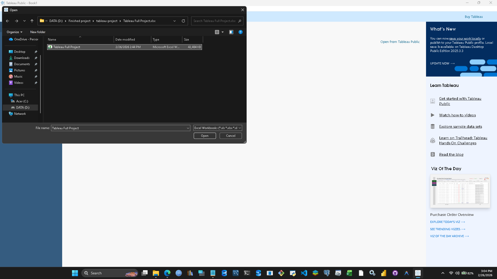
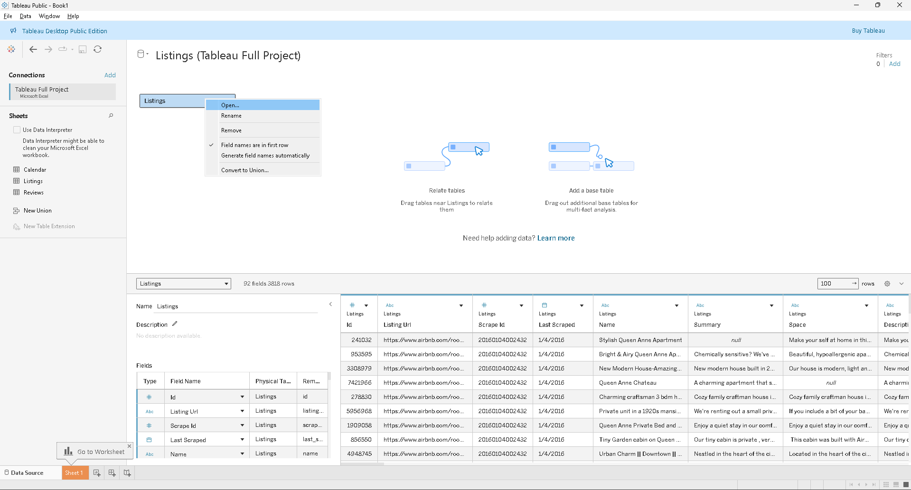
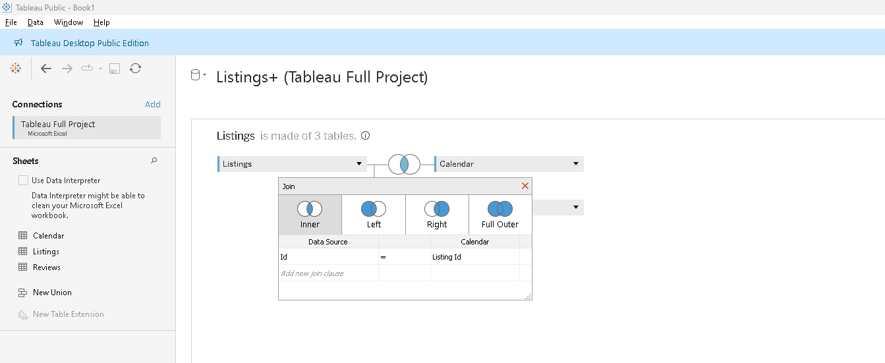
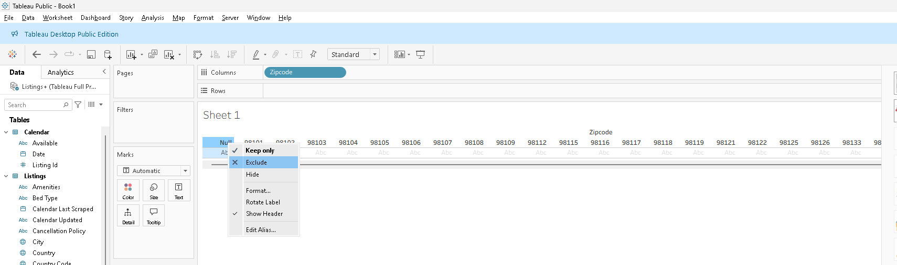
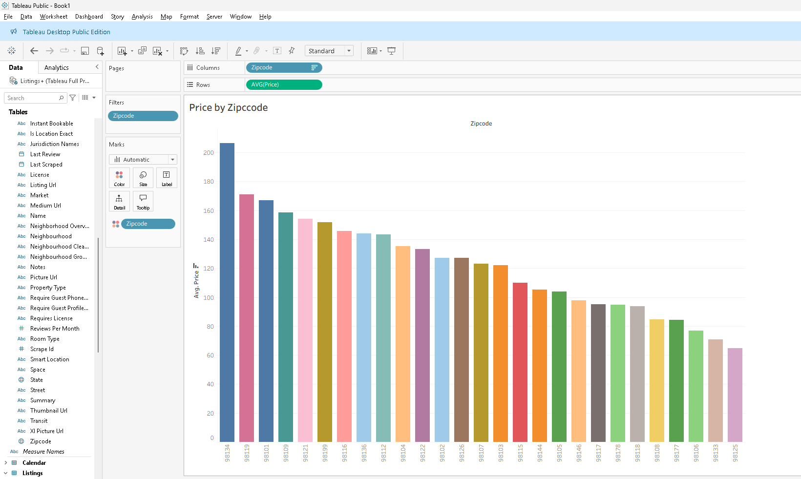
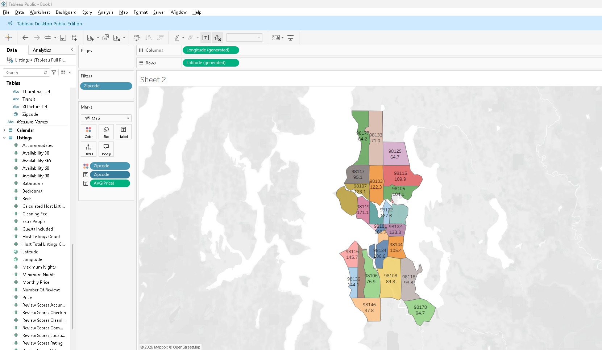
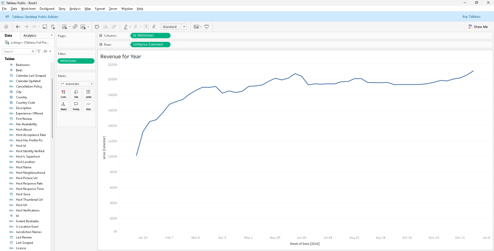
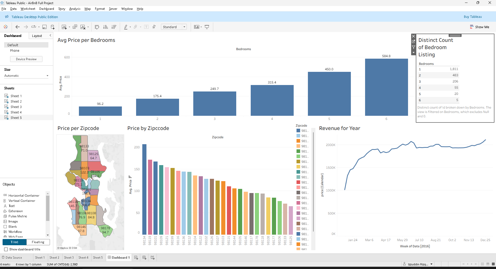

# 🏡 Seattle Airbnb Market Analysis — Tableau Project

> An end-to-end data analysis of Seattle Airbnb listings to uncover pricing hotspots, seasonal trends, and competitive landscape.

---

## 📌 Business Questions

| # | Question |
|---|----------|
| 1 | **Where are the most expensive areas?** — Which zip codes charge the highest rent? |
| 2 | **When should you list your home?** — What time of year drives the most revenue? |
| 3 | **What affects rent prices?** — Which property features push prices higher? |
| 4 | **What does the competition look like?** — How saturated is each bedroom category? |

---

## 🔧 Process Log

### Step 1 — Open Tableau & Load Dataset
> Launch Tableau Desktop and connect to the Airbnb dataset source.

---

### Step 2 — Open Listings Table
> Navigate to the **Listings** table. Tableau auto-detects fields and updates the schema preview.

---

### Step 3 — Join Calendar Table with Listings
> Add the **Calendar** table and perform an **Inner Join** on `id` to link pricing dates with listing details.

---

### Step 4 — Open Worksheet & Filter Zipcodes
> Open a new worksheet. Drag **Zipcode** to Columns and apply a filter to **exclude null** values.

---

### Step 5 — Sheet 1: Price by Zipcode (Bar Chart)
> Drag **Price** to Rows → set to `AVG(Price)` → sort descending. Add **Zipcode** to Marks (Color) for visual differentiation.

**Output:** `Price by Zipcode` bar chart

---

### Step 6 — Sheet 2: Price per Zipcode (Map)
> Drag **Zipcode** (as label) to Rows to generate a map view. Assign **Zipcode** as Color and `AVG(Price)` as the Label mark.

**Output:** `Price per Zipcode` choropleth map

---

### Step 7 — Sheet 3: Revenue for Year (Line Chart)
> Drag `WEEK(Date)` to Columns and `SUM(Price [Calendar])` to Rows. Filter date to a **1-year range** to track weekly revenue trends.

**Output:** `Revenue for Year` line chart

---

### Step 8 — Sheet 4: Avg Price per Bedrooms (Bar Chart)
> Convert **Bedrooms** to a **Dimension**. Drag to Columns. Drag `AVG(Price)` to Rows and add as a Label mark.

**Output:** `Avg Price per Bedrooms` bar chart

---

### Step 9 — Sheet 5: Distinct Count of Bedroom Listings
> Drag **Bedrooms** to Rows. Add **Bedrooms** to Filters (exclude `0` and `null`). Add `COUNT(DISTINCT Id)` as a Text mark to display listing counts.

**Output:** `Distinct Count of Bedroom Listings` table

---

### Step 10 — Dashboard Assembly
> Arrange all 5 sheets into a single **Dashboard**. Set size to **Automatic** for responsive layout.

**Output:** Final interactive dashboard

---

## 💡 Key Insights

### 1. 📍 Highest-Priced Zipcode
> **Zipcode 98134** commands the highest average rent at **$206.60/night**, making it the most premium area in the Seattle Airbnb market.

### 2. 📅 Best Time to List Your Home
> **January** is the lowest-revenue month. Revenue climbs steadily from **February** through to **December**, which hits the all-time high. List your property year-round but expect peak earnings in Q4.

### 3. 🛏️ What Affects Rent Prices
> **Number of bedrooms** is a direct price driver — more bedrooms = higher nightly rate. Larger homes command a premium, making them attractive for higher passive income potential.

### 4. 🏆 Competition Landscape

| Bedrooms | # of Listings |
|----------|--------------|
| 1        | 1,811        |
| 2        | 483          |
| 3        | 206          |
| 4        | 55           |
| 5        | 20           |
| 6        | 5            |

> The **1-bedroom** segment is by far the most saturated with **1,811 hosts**. Competition drops sharply as bedroom count increases — only **5 hosts** compete in the 6-bedroom space, presenting a potential opportunity for larger property owners.

---

## 🛠️ Tools Used

- **Tableau Desktop** — Data visualization & dashboard
- **Dataset** — Seattle Airbnb Listings & Calendar data

---

*Analysis covers Seattle Airbnb market data. All prices in USD.*
